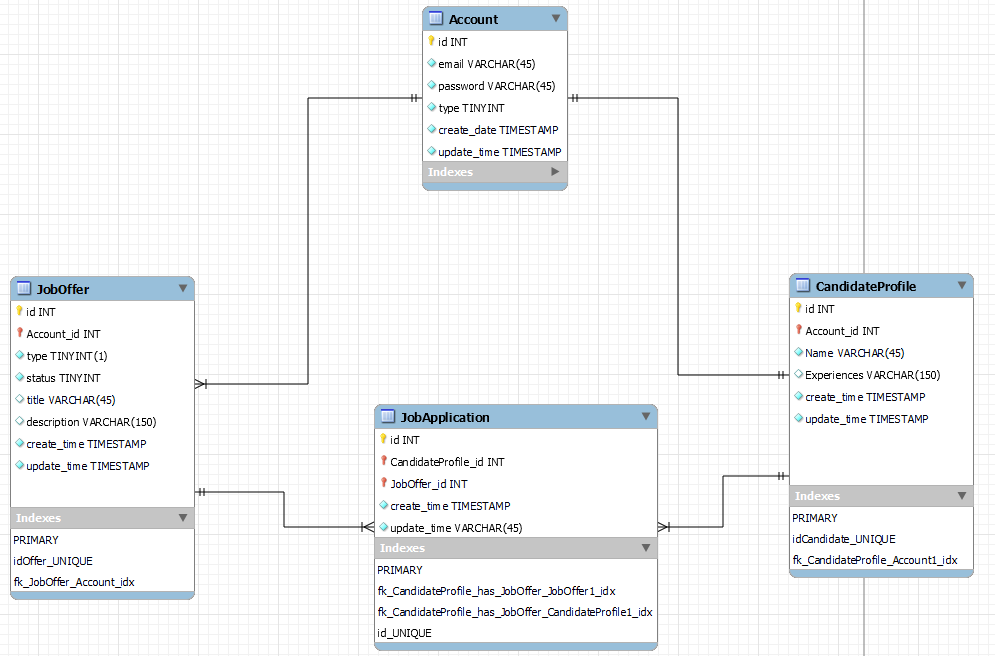

# Find a Job

Este repositório tem como objetivo implementar uma aplicação web para o teste prático de um processo seletivo.

A aplicação web consiste numa plataforma capaz de inscrever candidatos em oportunidades de emprego.

# Como executar

Para executar a aplicação é preciso ter o docker instalado em sua máquina.

Como instalar o Docker ?

Após concluir a instalação do Docker navegue atá a pasta do projeto em sua máquina.

Abra um terminal na pasta raiz e execute o seguinte comando:

    docker-compose up

Depois que os 3 containers estiverem em execução, é possível verificar isso tanto pelo terminal quanto pela aplicação Docker Desktop.

Abra seu navegador e acesse o endereço http://localhost:3000

E a seguinte tela deve ser carregada:

Pronto! A aplicação está sendo executada!

# Implementação do projeto

A implementação dessa aplicação foi dividida no desenvolvimento de 3 partes: Banco de dados, API RESTful e Interface Gráfica. 

## Banco de dados 

Para armazenar os dados da aplicação foi usado um banco de dados PostgreSQL constituiído por 4 diferentes tabelas: 



### Tabela **Account**

Essa tabela armazenerá os dados relacionados às contas dos usuários da aplicação:

- id: identificador do elemento na tabela
- email: email da conta para fazer login
- password: senha da conta para fazer login
- type: tipo de conta
- create_time: timestamp de quando o elemento foi criado
- update_time: timestamp da ultima vez que o elemento foi modificado

Uma conta pode ser de dois tipos: 

- type = 0 -> Conta de Empresa
- type = 1 -> Conta de Candidato

O tipo de conta determina as funcionalidades que o usuário pode acessar na aplicação web:

Contas de Empresa podem criar, editar e excluir vagas. Essas contas só podem visualizar as vagas pertencentes a ela e não podem se candidatar para vagas. Ao visualizar uma vaga, esse tipo de conta permite verificar todos os perfis que se candidatam para ela.

Contas de Candidato são atreladas a um perfil de candidato e podem editar esses perfis. Essas contas podem visualizar todas as vagas existentes na aplicação e podem se candidatar para elas. Ao visualizar uma vaga, um candidato não pode visualizar os outros perfis que se candidataram para aquela vaga. 

A tabela Account possui uma relação **one-to-many** com a tabela JobOffer, pois uma conta de usuário do tipo Empresa pode possuir várias vagas de emprego.

A tabela Account possui uma relação **one-to-one** com a tabela CandidateProfile, pois uma conta de usuário do tipo Candidato pode possuir um único perfil de candidato.


### Tabela **JobOffer**

A tabela JobOffer representa as vagas de emprego.

- id: identificador do elemento na tabela
- Account_id: identificador da conta a qual a vaga de emprego pertence
- type: tipo da vaga de emprego
- status: estado da vaga de emprego
- title: título da vaga de emprego
- description: descrição da vaga de emprego
- create_time: timestamp de quando o elemento foi criado
- update_time: timestamp da ultima vez que o elemento foi modificado

Uma conta pode ser de três tipos: 

- type = 0 -> CLT
- type = 1 -> PJ
- type = 2 -> Freelancer

Uma conta pode possuir dois estados:
- status = 0 -> Aberta
- status = 1 -> Pausada


### Tabela **CandidateProfile**

A tabela CandidateProfile representa o perfil dos candidatos.

- id: identificador do elemento na tabela
- Account_id: identificador da conta a qual o perfil está atrelado
- name: nome do candidato
- experiences: experiências do candidato
- title: título da vaga de emprego
- create_time: timestamp de quando o elemento foi criado
- update_time: timestamp da ultima vez que o elemento foi modificado

### Tabela **JobApplication**

A tabela JobApplication representa as candidaturas.

- id: identificador do elemento na tabela
- CandidateProfile_id: identificador do perfil de candidato que se aplicou a vaga
- JobOffer_id: identificador da vaga a qual o candidato se aplicou
- create_time: timestamp de quando o elemento foi criado
- update_time: timestamp da ultima vez que o elemento foi modificado

Uma candidatura é apenas uma relação entre perfis de candidatos e as vagas a quais eles se aplicaram.

Sendo assim essa tabela possibilita a relação **many-to-many** entre a tabela JobOffer e CandidateProfile. 

## API RESTful

A criação da API RESTful atua como um intermediário fundamental entre o banco de dados e a interface de usuário dessa aplicação. Ela desempenha o papel de uma ponte de comunicação eficiente, permitindo que as solicitações e respostas fluam de maneira organizada e padronizada entre essas duas partes.

A API foi desenvolvida utilizando Node.js como plataforma de execução (runtime) e fazendo uso da biblioteca Express.js, tendo como linguagem de programação TypeScript.

Foram desenvolvidos os principais endpoints para criação, edição, exclusão e listagem dos elementos das tabelas contidas no banco de dados apresentado.

<style>
required{
    color:red;
}
</style>

### Account

<details>

 <summary><code>POST</code> <code><b>/account</b></code> <code>Cria uma conta</code></summary>

#### Body Parameters
<table>
<tr>
<td> Name </td> <td> Data Type </td> <td>Description</td>
</tr>
<tr>
<td> <div>body</div> <required>required</required></td>
<td>


```json
{
    "email": "",
    "password": "",
    "type": 0
}
 ```

<td>
Account data
</td>
</td>
</tr>
</table>

#### Responses

<table>
<tr>
<td> Code </td> <td> Description </td>
</tr>
<tr>
<td> 200 </td>
<td>
	
Successful Operation

```json
{
"id": 0,
"account_id": 0,
"type": 0,
"status": 0,
"title": "",
"description": "",
"create_time": "",
"update_time": ""
}
 ```
</td>
</tr>

<tr>
<td> 500 </td>
<td>
Internal Server Error
</td>
</tr>

</table>


</details>

<details>

 <summary><code>GET</code> <code><b>/account</b></code> <code>Recupera uma conta</code></summary>

#### Query Parameters
<table>
<tr>
<td> Name </td> <td> Data Type </td> <td>Description</td>
</tr>
<tr>
<td> <div>email</div> <required>required</required></td><td>int<td>Account email to be selected</td></td>
</tr>
</table>

#### Responses

<table>
<tr>
<td> Code </td> <td> Description </td>
</tr>
<tr>
<td> 200 </td>
<td>
	
Successful Operation

```json
{
    "id": 0,
    "email": "",
    "password": "",
    "type": 0,
    "create_date": "",
    "update_time": ""
}
 ```
</td>
</tr>

<tr>
<td> 500 </td>
<td>
Internal Server Error
</td>
</tr>

</table>

</details>


<details>
 <summary><code>DELETE</code> <code><b>/account</b></code> <code>Atualiza uma conta</code></summary>


#### Query Parameters
<table>
<tr>
<td> Name </td> <td> Data Type </td> <td>Description</td>
</tr>
<tr>
<td> <div>Id</div> <required>required</required></td>
<td>
[int]
<td>
One or more account ids to be removed
</td>
</td>
</tr>
</table>        

#### Responses

<table>
<tr>
<td> Code </td> <td> Description </td>
</tr>
<tr>
<td> 200 </td>
<td>
	
Successful Operation
</td>
</tr>

<tr>
<td> 500 </td>
<td>
Internal Server Error
</td>
</tr>

</table>


</details>

### JobOffer


<details>

 <summary><code>POST</code> <code><b>/joboffer/{accountId}</b></code> <code>Cria uma nova vaga de emprego</code></summary>

#### Path Parameters
<table>
<tr>
<td> Name </td> <td> Data Type </td> <td>Description</td>
</tr>
<tr>
<td> <div>accountId</div> <required>required</required></td>
<td>

int
<td>
Account id that the job offer will be linked
</td>
</td>
</tr>
</table>


#### Body Parameters
<table>
<tr>
<td> Name </td> <td> Data Type </td> <td>Description</td>
</tr>
<tr>
<td> <div>body</div> <required>required</required></td>
<td>


```json
{
    "type": 0,
    "status": 0,
    "title": "",
    "description": ""
}
 ```

<td>
Job offer data
</td>
</td>
</tr>
</table>

#### Responses

<table>
<tr>
<td> Code </td> <td> Description </td>
</tr>
<tr>
<td> 200 </td>
<td>
	
Successful Operation

```json
{
    "id": 0,
    "account_id": 0,
    "type": 0,
    "status": 0,
    "title": "",
    "description": "",
    "create_time": "",
    "update_time": ""
}
 ```
</td>
</tr>

<tr>
<td> 500 </td>
<td>
Internal Server Error
</td>
</tr>

</table>

</details>


<details>

 <summary><code>UPDATE</code> <code><b>/joboffer</b></code> <code>Atualiza uma vaga de emprego</code></summary>

#### Query Parameters
<table>
<tr>
<td> Name </td> <td> Data Type </td> <td>Description</td>
</tr>
<tr>
<td> <div>id</div> <required>required</required></td>
<td>

int
<td>
JobOffer id to update
</td>
</td>
</tr>
</table>


#### Body Parameters
<table>
<tr>
<td> Name </td> <td> Data Type </td> <td>Description</td>
</tr>
<tr>
<td> <div>body</div> <required>required</required></td>
<td>


```json
{
    "type": 0,
    "status": 0,
    "title": "",
    "description": ""
}
 ```

<td>
Job offer data to update. It's not necessary to send all the fields in body, just the fields wanted to be updated.
</td>
</td>
</tr>
</table>

#### Responses

<table>
<tr>
<td> Code </td> <td> Description </td>
</tr>
<tr>
<td> 200 </td>
<td>
	
Successful Operation

```json
{
    "id": 0,
    "account_id": 0,
    "type": 0,
    "status": 0,
    "title": "",
    "description": "",
    "create_time": "",
    "update_time": ""
}
 ```
</td>
</tr>

<tr>
<td> 500 </td>
<td>
Internal Server Error
</td>
</tr>

</table>

</details>


<details>

 <summary><code>GET</code> <code><b>/joboffer</b></code> <code>Recupera uma ou várias vagas de emprego</code></summary>

#### Query Parameters
<table>
<tr>
<td> Name </td> <td> Data Type </td> <td>Description</td>
</tr>
<tr>
<td> <div>page</div> <required>required</required></td><td>int<td>Page offset</td></td>
</tr>
<tr>
<td> <div>size</div> <required>required</required></td><td>int<td>Limit of items to be selected</td></td>
</tr>
<tr>
<td> <div>id</div> <required>optional</required></td><td>[int]<td>One or multiple job offer ids to be listed </td></td>
<tr>
<tr>
<td> <div>accountId</div> <required>optional</required></td><td>[int]<td>One or multiple account ids to filter job offers by account id </td></td>
<tr>
<td> <div>type</div> <required>optional</required></td><td>[int]<td>one or multiple type numbers to filter job offers by types </td></td>
</tr>
<tr>
<td> <div>status</div> <required>optional</required></td><td>[int]<td>one or multiple status numbers to filter job offers by status </td></td>
</tr>
</table>

#### Responses

<table>
<tr>
<td> Code </td> <td> Description </td>
</tr>
<tr>
<td> 200 </td>
<td>
	
Successful Operation

```json
[
    {
        "id": 0,
        "account_id": 0,
        "type": 0,
        "status": 0,
        "title": "",
        "description": "",
        "create_time": "",
        "update_time": ""
    }
]
 ```
</td>
</tr>

<tr>
<td> 500 </td>
<td>
Internal Server Error
</td>
</tr>

</table>

</details>


<details>

 <summary><code>DELETE</code> <code><b>/joboffer</b></code> <code>Remove uma ou várias vagas de emprego</code></summary>

#### Query Parameters
<table>
<tr>
<td> Name </td> <td> Data Type </td> <td>Description</td>
</tr>
<td> <div>id</div> <required>optional</required></td><td>[int]<td>One or multiple job offer ids to be removed </td></td>
<tr>

</table>

#### Responses

<table>
<tr>
<td> Code </td> <td> Description </td>
</tr>
<tr>
<td> 200 </td>
<td>
	
Successful Operation
</td>
</tr>

<tr>
<td> 500 </td>
<td>
Internal Server Error
</td>
</tr>

</table>

</details>

### CandidateProfile


<details>

 <summary><code>POST</code> <code><b>/candidateprofile/{accountId}</b></code> <code>Cria um novo perfil de candidato</code></summary>

#### Path Parameters
<table>
<tr>
<td> Name </td> <td> Data Type </td> <td>Description</td>
</tr>
<tr>
<td> <div>accountId</div> <required>required</required></td>
<td>

int
<td>
Account id that the candidate profile will be linked
</td>
</td>
</tr>
</table>


#### Body Parameters
<table>
<tr>
<td> Name </td> <td> Data Type </td> <td>Description</td>
</tr>
<tr>
<td> <div>Body</div> <required>required</required></td>
<td>


```json
{
    "name": "",
    "experiences": "",
}
 ```

<td>
Candidate profile data
</td>
</td>
</tr>
</table>

#### Responses

<table>
<tr>
<td> Code </td> <td> Description </td>
</tr>
<tr>
<td> 200 </td>
<td>
	
Successful Operation

```json
{
    "id": 0,
    "account_id": 0,
    "name": "",
    "experiences": "",
    "create_time": "",
    "update_time": ""
}
 ```
</td>
</tr>

<tr>
<td> 500 </td>
<td>
Internal Server Error
</td>
</tr>

</table>

</details>


<details>

 <summary><code>UPDATE</code> <code><b>/candidateprofile</b></code> <code>Atualiza um perfil de candidato</code></summary>

#### Query Parameters
<table>
<tr>
<td> Name </td> <td> Data Type </td> <td>Description</td>
</tr>
<tr>
<td> <div>id</div> <required>required</required></td>
<td>

int
<td>
CandidateProfile id to update
</td>
</td>
</tr>
</table>


#### Body Parameters
<table>
<tr>
<td> Name </td> <td> Data Type </td> <td>Description</td>
</tr>
<tr>
<td> <div>body</div> <required>required</required></td>
<td>


```json
{
    "name": "",
    "experiences":""
}
 ```

<td>
Candidate profile data to update. It's not necessary to send all the fields in body, just the fields wanted to be updated.
</td>
</td>
</tr>
</table>

#### Responses

<table>
<tr>
<td> Code </td> <td> Description </td>
</tr>
<tr>
<td> 200 </td>
<td>
	
Successful Operation

```json
{
    "id": 0,
    "account_id": 0,
    "name": "",
    "experiences": "",
    "create_time": "",
    "update_time": ""
}
 ```
</td>
</tr>

<tr>
<td> 500 </td>
<td>
Internal Server Error
</td>
</tr>

</table>

</details>


<details>

 <summary><code>GET</code> <code><b>/candidateprofile</b></code> <code>Recupera um ou vários perfis de candidato</code></summary>

#### Query Parameters
<table>
<tr>
<td> Name </td> <td> Data Type </td> <td>Description</td>
</tr>
<tr>
<td> <div>page</div> <required>required</required></td><td>int<td>Page offset</td></td>
</tr>
<tr>
<td> <div>size</div> <required>required</required></td><td>int<td>Limit of items to be selected</td></td>
</tr>
<tr>
<td> <div>id</div> <required>optional</required></td><td>[int]<td>One or multiple candidate profile ids to be listed </td></td>
<tr>
<tr>
<td> <div>accountId</div> <required>optional</required></td><td>[int]<td>One or multiple account ids to filter candidate profiles by account id </td></td>
</table>

#### Responses

<table>
<tr>
<td> Code </td> <td> Description </td>
</tr>
<tr>
<td> 200 </td>
<td>
	
Successful Operation

```json
[
    {
        "id": 0,
        "account_id": 0,
        "type": 0,
        "status": 0,
        "title": "",
        "description": "",
        "create_time": "",
        "update_time": ""
    }
]
 ```
</td>
</tr>

<tr>
<td> 500 </td>
<td>
Internal Server Error
</td>
</tr>

</table>

</details>


<details>

 <summary><code>DELETE</code> <code><b>/candidateprofile</b></code> <code>Remove um ou vários perfis de candidato</code></summary>

#### Query Parameters
<table>
<tr>
<td> Name </td> <td> Data Type </td> <td>Description</td>
</tr>
<td> <div>id</div> <required>optional</required></td><td>[int]<td>One or multiple candidate profile ids to be removed </td></td>
<tr>

</table>

#### Responses

<table>
<tr>
<td> Code </td> <td> Description </td>
</tr>
<tr>
<td> 200 </td>
<td>
	
Successful Operation
</td>
</tr>

<tr>
<td> 500 </td>
<td>
Internal Server Error
</td>
</tr>

</table>

</details>

### JobApplications


<details>

 <summary><code>POST</code> <code><b>/jobapplication</b></code> <code>Cria uma nova candidatura</code></summary>


#### Body Parameters
<table>
<tr>
<td> Name </td> <td> Data Type </td> <td>Description</td>
</tr>
<tr>
<td> <div>Body</div> <required>required</required></td>
<td>


```json
{
    "candidateProfileId": 0,
    "jobOfferId": 0
}
 ```

<td>
Job application data
</td>
</td>
</tr>
</table>

#### Responses

<table>
<tr>
<td> Code </td> <td> Description </td>
</tr>
<tr>
<td> 200 </td>
<td>
	
Successful Operation

```json
{
    "id": 0,
    "candidateprofile_id": 0,
    "joboffer_id": 0,
    "create_time": "",
    "update_time": ""
}
 ```
</td>
</tr>

<tr>
<td> 500 </td>
<td>
Internal Server Error
</td>
</tr>

</table>

</details>


<details>

 <summary><code>UPDATE</code> <code><b>/jobapplication</b></code> <code>Atualiza uma candidatura</code></summary>

#### Query Parameters
<table>
<tr>
<td> Name </td> <td> Data Type </td> <td>Description</td>
</tr>
<tr>
<td> <div>id</div> <required>required</required></td>
<td>

int
<td>
Job Application id to update
</td>
</td>
</tr>
</table>


#### Body Parameters
<table>
<tr>
<td> Name </td> <td> Data Type </td> <td>Description</td>
</tr>
<tr>
<td> <div>body</div> <required>required</required></td>
<td>


```json
{
	"candidateProfileId": 0,
    "jobOfferId": 0
}
 ```

<td>
Job application data to update. It's not necessary to send all the fields in body, just the fields wanted to be updated.
</td>
</td>
</tr>
</table>

#### Responses

<table>
<tr>
<td> Code </td> <td> Description </td>
</tr>
<tr>
<td> 200 </td>
<td>
	
Successful Operation

```json
{
    "id": 0,
    "candidateprofile_id": 0,
    "joboffer_id": 0,
    "create_time": "",
    "update_time": ""
}
 ```
</td>
</tr>

<tr>
<td> 500 </td>
<td>
Internal Server Error
</td>
</tr>

</table>

</details>


<details>

 <summary><code>GET</code> <code><b>/jobapplication</b></code> <code>Recupera uma ou várias candidaturas</code></summary>

#### Query Parameters
<table>
<tr>
<td> Name </td> <td> Data Type </td> <td>Description</td>
</tr>
<tr>
<td> <div>page</div> <required>required</required></td><td>int<td>Page offset</td></td>
</tr>
<tr>
<td> <div>size</div> <required>required</required></td><td>int<td>Limit of items to be selected</td></td>
</tr>
<tr>
<td> <div>candidateProfileId</div> <required>optional</required></td><td>[int]<td>One or multiple candidate profile ids to filter job applications by candidate profiles </td></td>
<tr>
<tr>
<td> <div>jobOfferId</div> <required>optional</required></td><td>[int]<td>One or multiple job offer ids to filter job applications by job offers </td></td>
</table>

#### Responses

<table>
<tr>
<td> Code </td> <td> Description </td>
</tr>
<tr>
<td> 200 </td>
<td>
	
Successful Operation

```json
[
    {
        "id": 0,
        "candidateprofile_id": 0,
        "joboffer_id": 0,
        "create_time": "",
        "update_time": ""
    }
]
 ```
</td>
</tr>

<tr>
<td> 500 </td>
<td>
Internal Server Error
</td>
</tr>

</table>

</details>


<details>

 <summary><code>DELETE</code> <code><b>/jobapplication</b></code> <code>Remove uma ou várias candidaturas</code></summary>

#### Query Parameters
<table>
<tr>
<td> Name </td> <td> Data Type </td> <td>Description</td>
</tr>
<td> <div>id</div> <required>optional</required></td><td>[int]<td>One or job application ids to be removed </td></td>
<tr>

</table>

#### Responses

<table>
<tr>
<td> Code </td> <td> Description </td>
</tr>
<tr>
<td> 200 </td>
<td>
	
Successful Operation
</td>
</tr>

<tr>
<td> 500 </td>
<td>
Internal Server Error
</td>
</tr>

</table>

</details>


